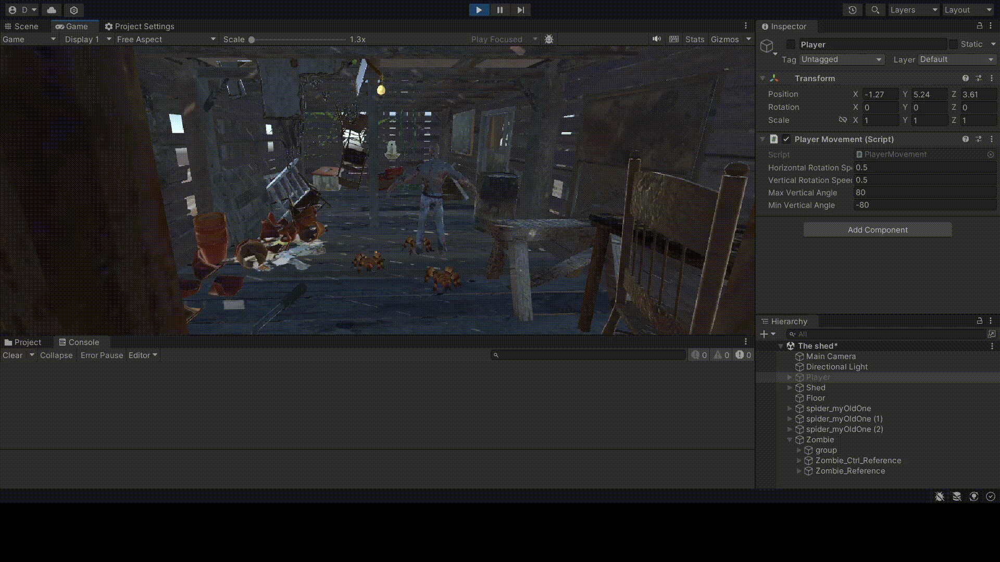
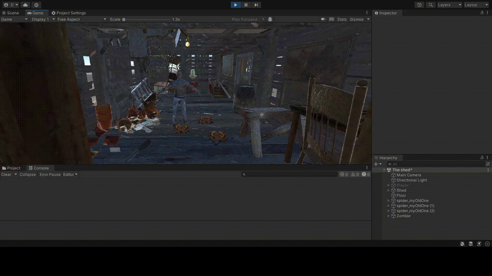
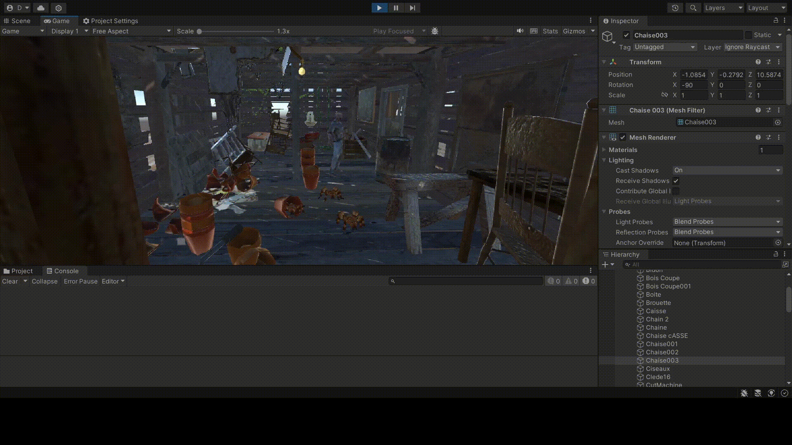

# II-Exam-VR

En este exámen se nos ha pedido trabajar con todo lo visto en prácticas anteriormente: Físicas, eventos y la Cardboard SDK. El ejercicio 1 no tiene ejecución porque era añadir todos los assets necesarios al proyecto. El ejercicio 7 está implementado el código pero no detecta que se está mirando la pizarra, se puede ver el código en el fichero ```scripts/session2/TableauController.cs```. A continuación se ven las ejecuciones de los ejercicios del 2 al 6.

## Ejecución del ejercicio 2


## Ejecución del ejercicio 3


## Ejecución del ejercicio 4


## Ejecución del ejercicio 5


## Ejecución del ejercicio 6

